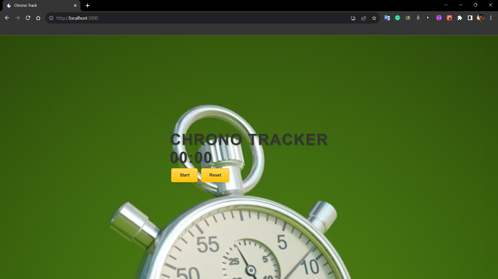

# Chrono Tracker App

A simple stopwatch app built using React.js.



## Table of Contents

- [Demo](#demo)
- [Features](#features)
- [Getting Started](#getting-started)
- [Usage](#usage)
- [Contributing](#contributing)
- [License](#license)

## Features

- Start, stop, and reset the stopwatch timer.
- [Add your app's features here]

## Getting Started

### Prerequisites

Before you begin, ensure you have met the following requirements:

- Node.js and npm installed on your machine.

### Installation

1. Clone the repository:

   ```bash
   git clone https://github.com/your-username/your-stopwatch-app.git

2. Navigate to the project folder

   ```bash
   cd your-stopwatch-app

3. Install dependencies

   ```bash
   npm install

## Usage

1. Start the development server

   ```bash
   npm start

2. Open your web browser and visit [here](http://localhost:3000)!

## Contributing
1. Fork the repository.
2. Create a new branch for your feature: git checkout -b feature-name
3. Commit your changes: git commit -m 'Add some feature'
4. Push to your branch: git push origin feature-name
5. Submit a pull request.
   
